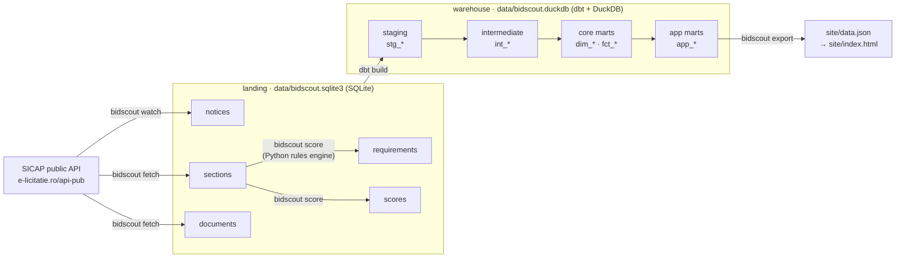

# Data model — where the data comes from and which tables the app reads

Every number on the page travels one road. Nothing reaches the page any
other way.



| Layer | Where | Written by | Rule |
|---|---|---|---|
| **Source** | `https://www.e-licitatie.ro/api-pub/` | the portal | Public, no sign-in. Endpoints and traps: `docs/data-sources.md`. |
| **Landing** | `data/bidscout.sqlite3` | `bidscout watch`, `fetch`, `score` | The portal's JSON exactly as it arrived (ground rule 3), plus the rules engine's output. Never edited by hand. |
| **Warehouse** | `data/bidscout.duckdb` | `dbt build` (project in `warehouse/`) | Landing attached **read-only**. Typed, joined, tested. |
| **Site** | `site/data.json` | `bidscout export` | Reads the four `app_*` marts and nothing else. |

`data/` is not committed: it is your own copy of the portal. `site/data.json`
is committed, because that is what GitHub Pages serves.

**One command runs the whole road after the portal:**
`bidscout export` (`make site`) scores landing, runs `dbt build`, and writes the
page's data from the app marts. Because `dbt build` runs the data tests too, a
broken contract stops the export rather than reaching the page.

**Why the decision is not in dbt.** The verdict (GO / CHECK / NO-GO) comes from
the Python rules engine (`src/bidscout/decide/`, rules in
`config/rules/it.yaml`). It works in `Decimal`, keeps the buyer's sentence
beside every figure, and is covered by most of the test suite. dbt models its
output (`requirements`, `scores`) like any other source and never re-decides.

---

## Landing tables (sources)

Declared in `warehouse/models/staging/*/_*__sources.yml`, attached as
`bidscout_landing`.

| Table | Grain | Comes from |
|---|---|---|
| `notices` | one row per notice (`c_notice_id`) | `POST NoticeCommon/GetCNoticeList` — the search item, whole, in `raw` |
| `sections` | one row per notice read | `GET NoticeCommon/GetSection3View?initNoticeId={cNoticeId}` — in `section3_raw` |
| `documents` | one row per attached file | `GET NoticeCommon/GetDfNoticeSectionFiles?initNoticeId={cNoticeId}` |
| `requirements` | one row per (notice, requirement kind) | `bidscout score` — what the extractor read, with its quote |
| `scores` | one row per (notice, company) | `bidscout score` — the verdict, reasons and unresolved gates as JSON |

(`buyers` also exists in landing for the CLI; the warehouse builds its own
`dim_buyers` from the notices instead.)

## Staging — `staging.stg_*` (views)

One model per landing table. Parse the raw JSON, type and rename. No joins.

| Model | What it adds |
|---|---|
| `stg_sicap__notices` | Every field from the search item: `notice_kind` (contract / simplified / concession), buyer CUI split from the name and normalised to digits, CPV code and name, procedure and contract type, `estimated_value_ron` as `DECIMAL(18,2)`, timestamps |
| `stg_sicap__sections` | `is_portal_error` (the portal's "not found"), the criteria fields as HTML, the boolean flags |
| `stg_sicap__documents` | `file_extension`, public `download_url` |
| `stg_bidscout__requirements` | `amount_text` (exactly as stored) and `amount` (decimal) |
| `stg_bidscout__scores` | reasons and unresolved as JSON |

## Intermediate — `intermediate.int_*` (views)

| Model | What it decides |
|---|---|
| `int_notices__read_status` | How far each notice has got: `scored`, `read, not scored`, `portal refused`, `no known endpoint` (simplified and concession notices), `awaiting fetch` |

## Core marts — `core.*` (tables)

The analytical model. Query these for anything about the market.

| Table | Grain / key | Use it for |
|---|---|---|
| `dim_buyers` | `buyer_key` (CUI, or name when none is printed) | who buys, how often, how much |
| `dim_cpv` | `cpv_code` (primary CPV only) | what is bought |
| `fct_notices` | `c_notice_id` | every notice with its `read_status` and file count |
| `fct_documents` | (`c_notice_id`, `document_guid`) | the tender files and their download links |
| `fct_requirements` | (`c_notice_id`, `requirement_kind`) | what buyers ask for, with the sentence |
| `fct_verdicts` | (`c_notice_id`, `company`) | GO / CHECK / NO-GO and the score |
| `fct_verdict_reasons` | (`c_notice_id`, `company`, `reason_index`) | each line of an explanation, with `outcome` |

## App marts — `app.*` (tables) — the frontend's contract

`bidscout export` reads these four and nothing else
(`bidscout.warehouse.APP_MARTS`). They are filtered to the company in the
profile (`--vars company`). A new page feature starts by adding a column here.

| Table | Grain | Becomes in `data.json` |
|---|---|---|
| `app_tenders` | one row per landed notice | `tenders` (scored) and `skipped` (not scored, with `read_status`) |
| `app_tender_reasons` | one row per reason line | `tenders[].reasons` |
| `app_tender_requirements` | one row per requirement | `tenders[].requirements` |
| `app_pipeline_status` | one row per `read_status` | `pipeline.read_status` — the page's "where this data comes from" |

## Tests that hold the contract

Run by every `dbt build`, so by every export. Defined in the `_*__models.yml`
files and `warehouse/macros/`.

- **Keys** — `unique` + `not_null` on every grain, and `unique_combination` on
  composite grains.
- **Relationships** — sections and documents point at a notice; every
  notice's buyer and CPV exist in their dimensions; every reason points at an
  app tender.
- **Accepted values** — `decision`, `outcome`, `confidence`, `read_status`,
  `notice_kind`.
- **`scored_iff_decided`** — ground rule 2 at the boundary: a decision appears
  on `app_tenders` if and only if the notice was read and scored.

## Querying it

```bash
bidscout transform                    # build data/bidscout.duckdb on its own
.venv/Scripts/python -c "import duckdb; print(duckdb.connect('data/bidscout.duckdb', read_only=True).sql('select * from core.dim_buyers order by notices desc limit 10'))"
make docs                             # dbt docs: every model, column and the lineage graph
```

The demo works the same way: `data/demo.sqlite3` builds `data/demo.duckdb`.
